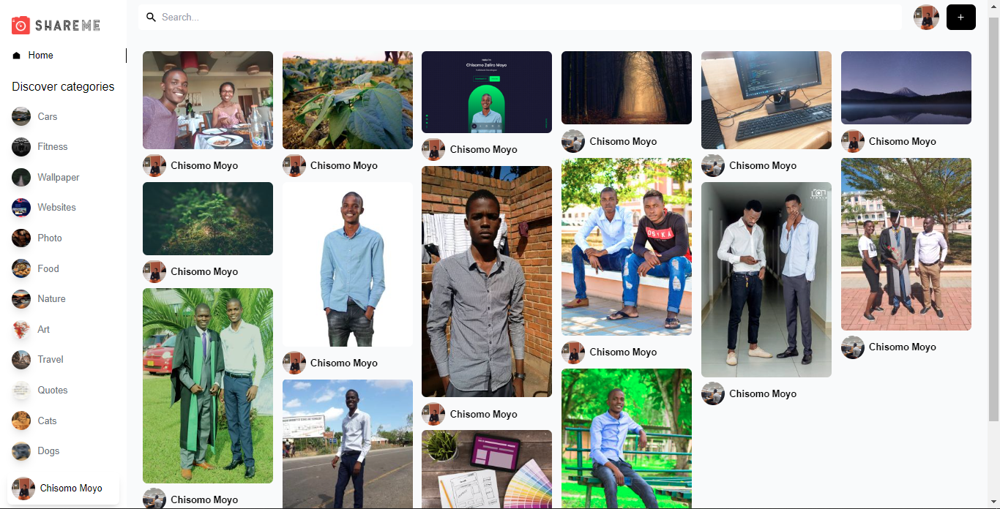

# Shareme-Photo-Share-App

This is a photo sharing web application [SHAREME](https://shareme-chzmo.netlify.app/).

## Table of contents

- [Overview](#overview)
  - [Screenshot](#Screenshot)
  - [Links](#links)
- [My process](#my-process)
  - [Built with](#built-with)
  - [Continued development](#continued-development)
- [Author](#author)

## Overview

Users should be able to:

- View the application on defferent devices
- Login using their Email
- View different pins/images posted by other users
- View specific pins selected by the user with related pins if exits
- Create a Pin by clicking a on a plus button and filling all details
- Logout from the system

### Screenshot

### Links

- Live Site URL: [https://shareme-chzmo.netlify.app/](https://shareme-chzmo.netlify.app/)

## My process

### Built with

- Semantic HTML5 markup
- CSS custom properties
- Flexbox
- Mobile-first workflow
- [Tailwind](https://tailwindcss.com/)
- [Sanity Studio](https://www.sanity.io/) - Backend
- [Goodle OAuth](https://developers.google.com/identity/protocols/oauth2) - Authentication
- [ReactJs](https://swiperjs.com/) - Js Framework

### Continued development

- Still working on the design and adding more features!!!!

## Author

- Website - [Chisomo Zaliro Moyo](https://www.chzmo.com)
- Happy Coding!